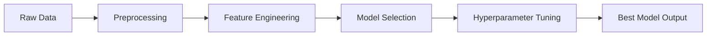

# 🚀 AutoDML – Automated Deep Machine Learning Framework

> ⚡ Build, optimize, and deploy ML/DL models automatically — faster than ever.

---

## 🌐 Live Demo

👉 https://autodml.streamlit.app/

---

## 📌 Overview

**AutoDML** is an end-to-end automation framework for Machine Learning and Deep Learning workflows.

It eliminates repetitive tasks and allows you to focus on **results instead of process**.

---

## ✨ Key Features

- 🔄 Automated Data Preprocessing
- 🧠 Smart Model Selection (ML + DL)
- ⚙️ Hyperparameter Optimization
- 📊 Performance Evaluation
- 🧩 Modular Architecture
- 🚀 Streamlit Web App Integration

---

## 🧠 Workflow



---

## 📂 Project Structure

```

AutoDML/

│── data/

│── models/

│── src/

│   ├── preprocessing/

│   ├── training/

│   ├── tuning/

│   ├── utils/

│── app/

│── notebooks/

│── requirements.txt

│── README.md

```

---

## ⚙️ Installation

```bash

gitclonehttps://github.com/Manthan27525/AutoDML.git

cdAutoDML


python-mvenvvenv

sourcevenv/bin/activate

# Windows:

venv\Scripts\activate


pipinstall-rrequirements.txt

```

---

## 🚀 Usage

### Run Locally

```bash

streamlitrunapp.py

```

### Python Usage

```python

from autodml import AutoDML


model = AutoDML()

model.fit(X_train, y_train)


preds = model.predict(X_test)

```

---

## 📊 Output

- ✅ Best Model Automatically Selected
- ⚡ Optimized Hyperparameters
- 📈 Evaluation Metrics
- 💾 Ready-to-use trained model

---

## 🛠️ Tech Stack

- Python
- Scikit-learn
- TensorFlow / PyTorch
- Pandas & NumPy
- Optuna / GridSearch
- Streamlit

---

## 🎯 Use Cases

- 📈 Stock Market Prediction
- 🤖 AutoML Systems
- 🎓 Academic Projects
- 📊 Data Science Pipelines

---

## 🔮 Future Scope

- LLM + RAG Integration
- Auto Feature Engineering
- Explainable AI (SHAP/LIME)
- Dashboard Analytics

---

## 🤝 Contributing

Pull requests are welcome!

```bash

gitcheckout-bfeature-name

gitcommit-m"Added feature"

gitpushoriginfeature-name

```

---

## 👨‍💻 Author

**Manthan Singh**

GitHub: https://github.com/Manthan27525

---

## ⭐ Support

If you like this project:

- ⭐ Star the repo
- 🍴 Fork it
- 🚀 Share it

---

## 💡 Tagline

> “Automate ML. Accelerate Innovation.”
>
