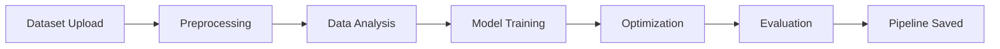

<<<<<<< HEAD
# 🚀 AutoDML – End-to-End Automated Machine Learning Pipeline
=======
# 🚀 AutoDML – Automated Data Mining and Machine Learning Framework
>>>>>>> 6c73d212f854b6ca6c29f5a7ac0f5cb79c4b35ab

<p align="center">
  <b>Build, optimize, and deploy ML pipelines automatically with a modular architecture</b>
</p>

<p align="center">
  <a href="https://autodml.streamlit.app/"></a>
  
  
  
</p>

---

## 🌐 Live Application

👉 https://autodml.streamlit.app/

---

## 🧠 Problem Statement

Building ML models involves repetitive steps:

- Data cleaning
- Feature engineering
- Model selection
- Hyperparameter tuning

These steps are **time-consuming and error-prone**.

---

## 💡 Solution – AutoDML

**AutoDML** automates the entire ML pipeline with a clean, modular design.

✔ Upload dataset
✔ Automatic preprocessing
✔ Model training & optimization
✔ Evaluation & reporting
✔ Ready-to-use pipeline

---

## ⚡ Key Features

- 🔄 End-to-End ML Pipeline Automation
- 🧩 Modular Architecture (Plug & Play components)
- 📊 Data Analysis & Visualization
- 🤖 Model Training & Evaluation
- ⚙️ Hyperparameter Optimization
- 📁 Pipeline Saving & Reusability
- 📝 Logging & Exception Handling

---

## 🏗️ Architecture



---

## 📂 Project Structure

```
AutoDML/
│── api/                  # Entry point
│── autodml/              # Core ML modules
│   ├── preprocessing.py
│   ├── modeling.py
│   ├── optimization.py
│   ├── evaluation.py
│   ├── pipeline.py
│   ├── data_analysis.py
│   ├── data_visualization.py
│   ├── registry.py
│   ├── core.py
│   ├── utils/
│   └── nlp/
│
│── data/                 # Outputs & artifacts
│── uploads/              # Input dataset
│── pipeline/             # Saved pipeline
│── logs/                 # Logging
│── Dockerfile
│── requirements.txt
│── setup.py
```

---

## 🚀 How to Run

```bash
git clone https://github.com/Manthan27525/AutoDML.git
cd AutoDML

python -m venv venv
venv\Scripts\activate

pip install -r requirements.txt
```

### ▶ Run App

```bash
python api/main.py
```

---

## 📊 Output Artifacts

- 📁 Processed Data
- 📈 Visualizations
- 📊 Analytical Reports
- 🤖 Trained Models
- 🔁 Serialized Pipeline (`pipeline.pkl`)

---

## 🛠️ Tech Stack

- Python
- Pandas, NumPy
- Scikit-learn
- NLTK
- Streamlit
- Docker

---

## 🎯 Why This Project Matters

This project demonstrates:

✔ Strong understanding of ML lifecycle
✔ Clean modular system design
✔ Production-level practices (logging, pipelines)
✔ Ability to build scalable ML systems

---

## 🔮 Future Scope

- 🔗 LLM + RAG integration
- 📊 Advanced Auto Feature Engineering
- ⚡ Real-time prediction API
- 📉 Model explainability (SHAP/LIME)

---

## 👨‍💻 Author

**Manthan Singh**
🔗 https://github.com/Manthan27525

---

## ⭐ Support

If you like this project:

- ⭐ Star the repo
- 🍴 Fork it
- 🚀 Share it

---

## 💬 Tagline

> Automate Machine Learning. Focus on Insights.
>
